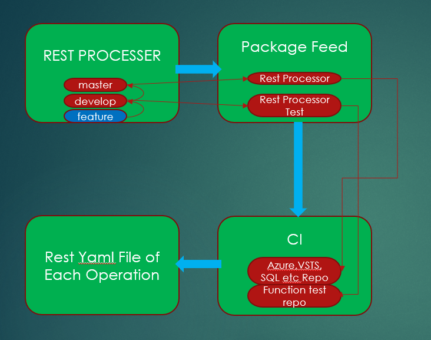

# Rest Api Processor

Rest processor help us transform swagger.json(v2) to schema base yaml file by opeartion.

## Build & deployment status

|  Environment (Branch)  |  Build Status  |  Package  |  Function Test Status |
| ---------------------- | -------------- | --------- |  -------------------- |
| `PROD` (**master** branch) | [status](https://apidrop.visualstudio.com/Content%20CI/Content%20CI%20Team/_build?definitionId=184) | [nuget package](https://apidrop.visualstudio.com/Content%20CI/Content%20CI%20Team/_packaging?feed=ReferenceAutomation&package=RestProcessor&version=2018.9.24.1&protocolType=NuGet&_a=package)| No
| `PPE` (**develop** branch) | [status](https://apidrop.visualstudio.com/Content%20CI/Content%20CI%20Team/_build?definitionId=452) | [nuget package](https://apidrop.visualstudio.com/Content%20CI/Content%20CI%20Team/_packaging?feed=ReferenceAutomation&package=RestProcessor-Test&version=2018.9.25.2&protocolType=NuGet&_a=package)| [test](https://apidrop.visualstudio.com/Content%20CI/Content%20CI%20Team/_build?definitionId=1129)

## Understanding development workflow

`develop` is the branch for development and will release the package each time when code is merged.

- You are suggested to open a feature branch based on `develop` and make changes in your feature branch.
- You can test your feature in local with some command line arguments.
- Once the feature branch is ready, open a PR towards `develop`.
- Changes merged into `develop` will be released a package immediately to `RestProcessor-Test` feed.
- After the package released, it will trigger a ci build with function test and impact test.

`master` branch is the branch for `PROD` deployment.

- when we need a feature release, `develop` will be merged into `master`.
- Changes merged into `master` will be release a package immediately to `RestProcessor` feed.

